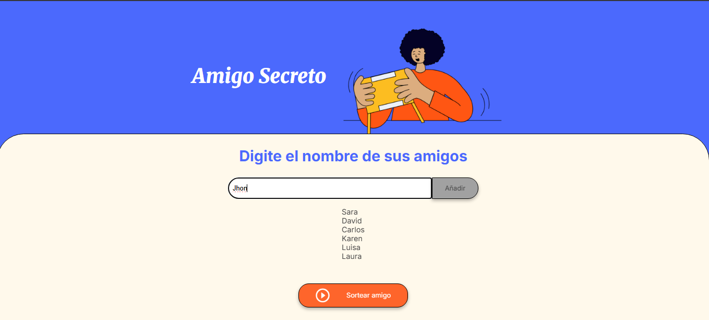
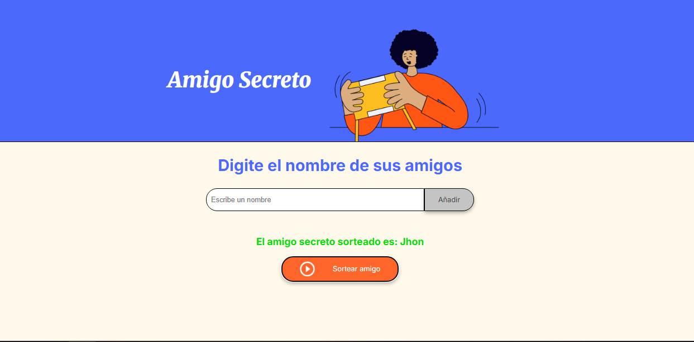
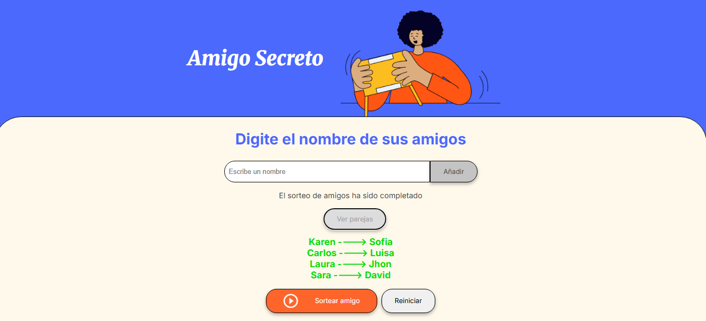

# Sorteo de Amigo Secreto

Este proyecto es una aplicación web simple en JavaScript que permite organizar un sorteo de amigo secreto entre varios participantes.

---

## Funcionalidades

- Agregar participantes (mínimo 4 y cantidad **par**).
- Validación de nombres.
- Sorteo aleatorio de amigos sin repeticiones.
- Visualización de las parejas generadas.
- Reiniciar el sorteo.

---

## Vista previa

### Agregar amigos:


### Sorteo amigos:


### Resultado del sorteo:


---

## Cómo usar

1. Clona este repositorio:

```bash
git clone https://github.com/freider45/sorteo-amigo-secreto.git
cd sorteo-amigo-secreto

Abre el archivo index.html en tu navegador.

¡Y listo! Ya puedes usar la app.
